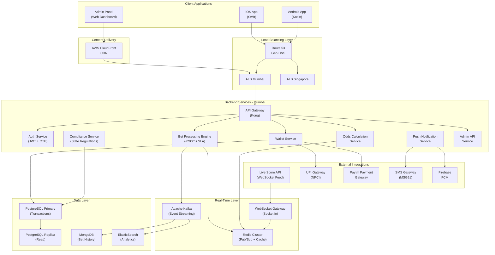
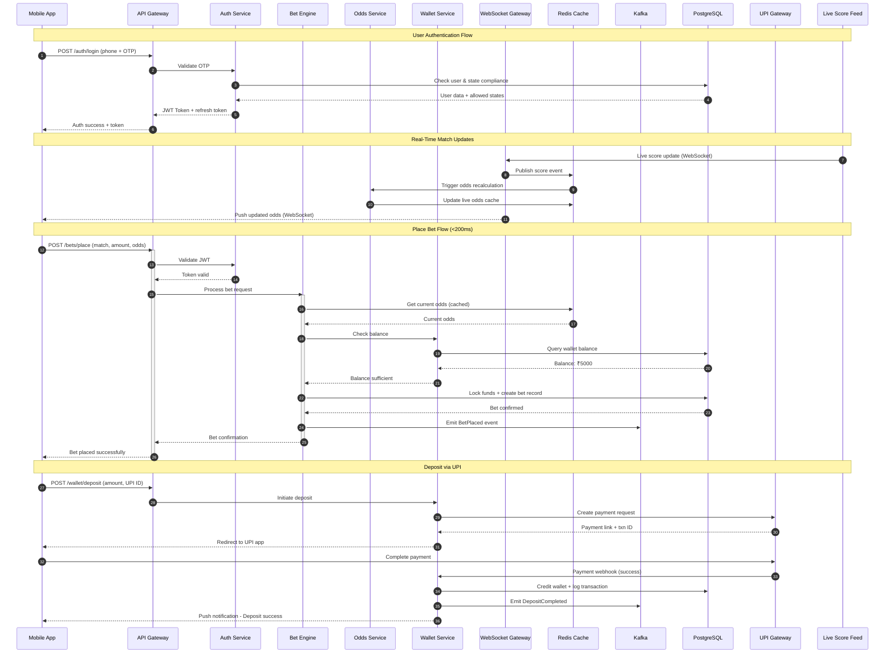
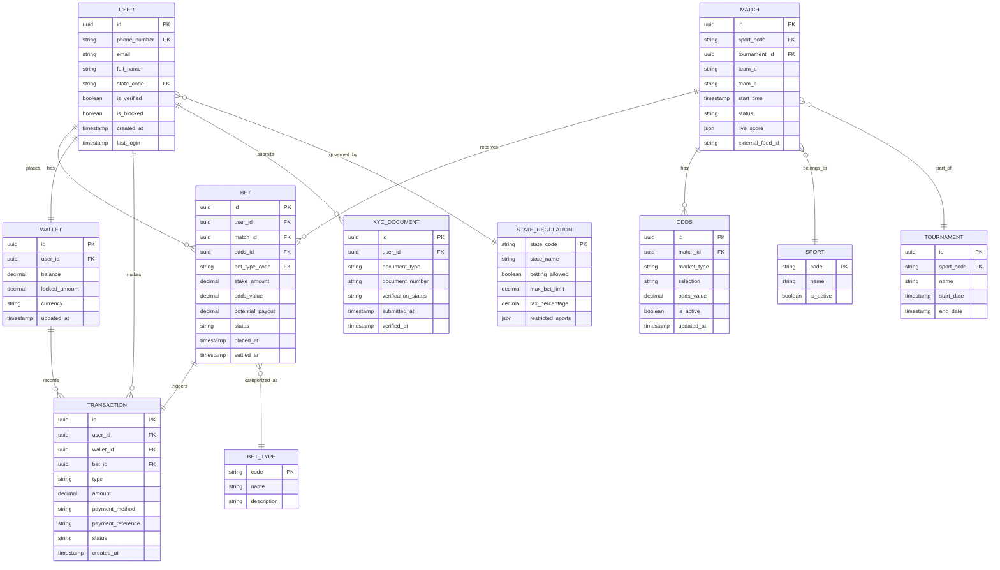
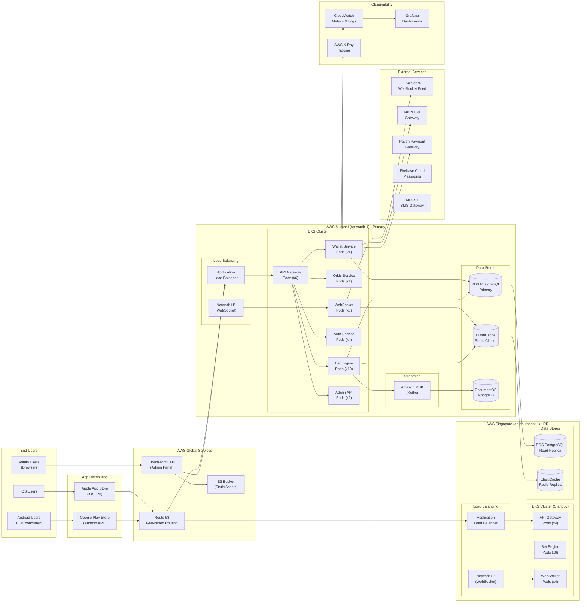

# System Architecture Document

## Project Overview
**Repository:** SmitVgithub/ibm
**Language:** nodejs
**Request:** Design a real-time sports betting platform called "BetStream" for the Indian market. It must handle 100,000 concurrent users during IPL matches, process bets within 200ms, integrate with live score feeds via WebSocket, support UPI and Paytm payments, comply with state-level gambling regulations, and provide a web-based admin panel plus Android and iOS apps for bettors. Need multi-region deployment (Mumbai + Singapore) with automatic failover.

## Architecture Diagram

### Request Flow

### Database Schema

### Deployment Architecture

## Architecture Narrative

Design a real-time sports betting platform called "BetStream" for the Indian market. It must handle 100,000 concurrent users during IPL matches, process bets within 200ms, integrate with live score feeds via WebSocket, support UPI and Paytm payments, comply with state-level gambling regulations, and provide a web-based admin panel plus Android and iOS apps for bettors. Need multi-region deployment (Mumbai + Singapore) with automatic failover.

---
*Generated by Blueprint Brain 1.7*
