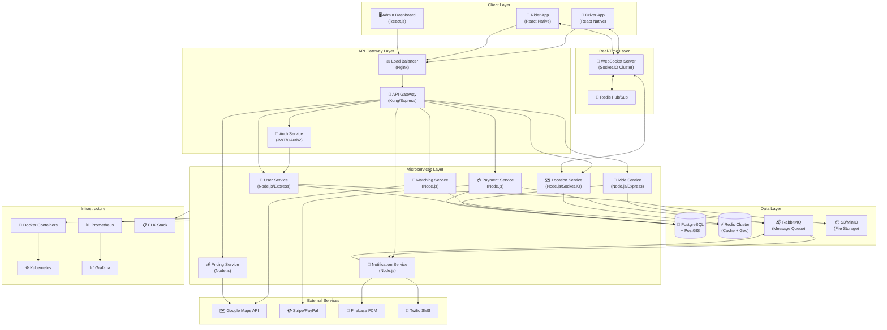
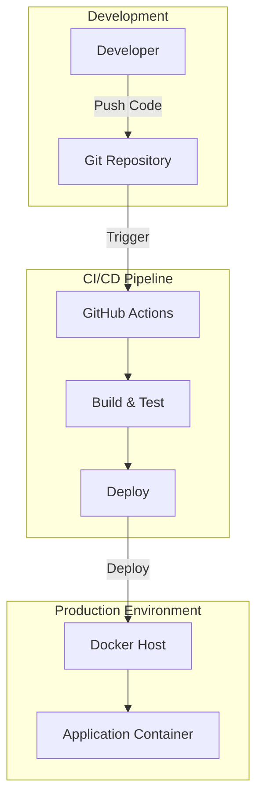

# Architecture Document — ibm

> Generated by Blueprint Brain

**Repository:** ibm  
**Language:** nodejs  
**Request:** Create a taxi driver application with a real-time ride sharing.

---

## Architectural Analysis

This taxi driver application with real-time ride sharing requires a robust, scalable architecture designed for high concurrency and low latency. The core challenge is managing real-time location updates, matching drivers with riders efficiently, and ensuring reliable communication between all parties.

**Architecture Decision Rationale:**

1. **Microservices Architecture**: I've chosen a microservices approach to separate concerns between user management, ride matching, real-time tracking, payments, and notifications. This allows independent scaling of the most resource-intensive components (location tracking and matching algorithm).

2. **Real-Time Communication**: WebSocket connections via Socket.IO provide bidirectional real-time communication essential for live location updates, ride status changes, and instant notifications. This is more efficient than polling for a ride-sharing application where updates happen every 2-5 seconds.

3. **Redis for Geospatial Queries**: Redis with its GEOADD/GEORADIUS commands provides O(log(N)) complexity for finding nearby drivers, making it ideal for the matching service. It also serves as a pub/sub mechanism for real-time events and caching layer.

4. **PostgreSQL with PostGIS**: For persistent storage, PostgreSQL with PostGIS extension handles complex geospatial queries for historical data, route optimization, and analytics. The relational model suits our transactional requirements for rides and payments.

5. **Message Queue (RabbitMQ)**: Decouples services and handles peak loads gracefully. Critical for processing payments, sending notifications, and maintaining event sourcing for ride history.

6. **API Gateway Pattern**: Kong/Express Gateway handles authentication, rate limiting, and request routing, providing a single entry point and protecting backend services.

**Trade-offs Considered:**
- Chose WebSockets over Server-Sent Events for bidirectional communication needs
- Selected Redis over MongoDB for geospatial due to superior performance for real-time queries
- Microservices over monolith despite added complexity, as scaling individual services is critical
- PostgreSQL over pure NoSQL to maintain ACID compliance for financial transactions

**Scalability Approach:**
- Horizontal scaling of stateless services behind load balancer
- Redis Cluster for distributed caching and geospatial data
- Database read replicas for query distribution
- Event-driven architecture for loose coupling

## Summary

This architecture delivers a production-ready taxi ride-sharing platform using a microservices approach optimized for real-time operations. The system handles driver-rider matching through Redis geospatial queries, maintains live location tracking via WebSocket connections, and processes payments securely through Stripe integration. Key architectural decisions include using PostgreSQL with PostGIS for persistent geospatial data, Redis for real-time caching and pub/sub, and RabbitMQ for reliable async processing. The infrastructure is containerized with Docker and orchestrated via Kubernetes for horizontal scaling. The 20-week implementation plan progresses from core services through mobile apps to production deployment, with comprehensive monitoring via Prometheus/Grafana and logging through ELK stack.

## System Architecture

## Deployment Architecture

## Component Breakdown

**1. User Service**
Handles driver and rider registration, authentication, profile management, and document verification. Stores user data in PostgreSQL with encrypted sensitive fields. Manages driver availability status and ratings.

**2. Ride Service**
Core business logic for ride lifecycle: request creation, status management (requested → accepted → in_progress → completed), fare calculation, and ride history. Implements saga pattern for distributed transactions.

**3. Matching Service**
Real-time driver-rider matching using Redis GEORADIUS queries. Implements intelligent matching algorithm considering: proximity (primary), driver rating, vehicle type, and estimated arrival time. Handles surge pricing triggers.

**4. Location Service**
Processes 1000s of location updates per second via WebSocket. Updates driver positions in Redis (GEOADD) with TTL. Broadcasts location changes to relevant riders. Maintains location history in PostgreSQL for analytics.

**5. Payment Service**
Integrates with Stripe/PayPal for secure payments. Handles wallet top-ups, ride payments, driver payouts, and refunds. Implements idempotency for payment operations. PCI-DSS compliant design.

**6. Notification Service**
Multi-channel notifications: push (FCM), SMS (Twilio), email. Consumes events from RabbitMQ. Implements notification preferences and rate limiting. Critical for ride status updates.

**7. Pricing Service**
Dynamic pricing engine calculating fares based on: distance, time, demand (surge multiplier), vehicle type, and promotions. Integrates with Google Maps for route estimation.

**8. WebSocket Server**
Socket.IO cluster with Redis adapter for horizontal scaling. Handles rooms for ride-specific communication. Implements heartbeat for connection health. Manages 10K+ concurrent connections per node.

## Technology Stack

**Backend Framework:** Node.js 20 LTS with Express.js
- Justification: Non-blocking I/O ideal for real-time applications, large ecosystem, team familiarity

**Real-Time:** Socket.IO 4.x with Redis Adapter
- Justification: Reliable WebSocket abstraction with fallbacks, built-in room management, horizontal scaling support

**Primary Database:** PostgreSQL 15 with PostGIS
- Justification: ACID compliance for transactions, PostGIS for geospatial queries, mature and reliable

**Cache & Geospatial:** Redis 7 Cluster
- Justification: Sub-millisecond latency, native geospatial commands, pub/sub for real-time events

**Message Queue:** RabbitMQ 3.12
- Justification: Reliable message delivery, dead letter queues, better for complex routing than Redis streams

**Mobile Apps:** React Native
- Justification: Code sharing between iOS/Android, large community, good performance for maps

**Admin Dashboard:** React.js with TypeScript
- Justification: Type safety, component reusability, rich ecosystem

**API Gateway:** Kong or Express Gateway
- Justification: Rate limiting, authentication, request transformation, logging

**Container Orchestration:** Docker + Kubernetes
- Justification: Scalability, self-healing, rolling deployments

**Monitoring:** Prometheus + Grafana + ELK Stack
- Justification: Industry standard, comprehensive metrics and logging

## Implementation Phases

**Phase 1: Foundation (Weeks 1-3)**
- Set up monorepo structure with shared packages
- Configure Docker development environment
- Implement User Service with authentication (JWT)
- Set up PostgreSQL with initial schema
- Create basic CI/CD pipeline
- Deliverable: User registration and login working

**Phase 2: Core Services (Weeks 4-6)**
- Implement Location Service with WebSocket
- Set up Redis for geospatial data
- Build Matching Service with basic algorithm
- Create Ride Service with state machine
- Deliverable: Basic ride request and matching flow

**Phase 3: Real-Time Features (Weeks 7-9)**
- Implement real-time location tracking
- Build driver availability management
- Create ride status broadcasting
- Implement ETA calculations with Google Maps
- Deliverable: Live tracking working end-to-end

**Phase 4: Payments & Notifications (Weeks 10-12)**
- Integrate Stripe payment processing
- Implement Pricing Service with surge logic
- Build Notification Service (push + SMS)
- Set up RabbitMQ for async processing
- Deliverable: Complete ride with payment

**Phase 5: Mobile Apps (Weeks 13-16)**
- Build Driver app with React Native
- Build Rider app with React Native
- Implement maps integration
- Add offline support and error handling
- Deliverable: Beta-ready mobile applications

**Phase 6: Production Readiness (Weeks 17-20)**
- Set up Kubernetes cluster
- Implement monitoring and alerting
- Load testing and optimization
- Security audit and penetration testing
- Admin dashboard completion
- Deliverable: Production deployment

## Risk Analysis

**1. Real-Time Scalability Risk**
- Risk: WebSocket connections overwhelming servers during peak hours
- Mitigation: Socket.IO clustering with Redis adapter, horizontal pod autoscaling, connection pooling
- Monitoring: Track concurrent connections, implement circuit breakers

**2. Location Data Accuracy**
- Risk: GPS drift causing incorrect driver positions and matching
- Mitigation: Kalman filtering for location smoothing, validation of impossible movements, fallback to cell tower triangulation

**3. Payment Failures**
- Risk: Payment processing failures causing ride completion issues
- Mitigation: Idempotent payment operations, retry with exponential backoff, wallet balance as fallback, manual resolution queue

**4. Database Performance**
- Risk: PostgreSQL becoming bottleneck with high write volume
- Mitigation: Read replicas, connection pooling (PgBouncer), partitioning ride history by date, Redis caching for hot data

**5. Third-Party Service Dependency**
- Risk: Google Maps or Stripe outages affecting core functionality
- Mitigation: Fallback to OpenStreetMap/Mapbox, multiple payment providers, circuit breaker pattern, graceful degradation

**6. Security Vulnerabilities**
- Risk: Data breaches exposing user location and payment data
- Mitigation: Encryption at rest and in transit, regular security audits, OWASP compliance, rate limiting, input validation

**7. Driver-Rider Disputes**
- Risk: Fare disputes and safety incidents
- Mitigation: Ride recording consent, detailed trip logs, in-app support chat, automated refund rules

## Required Secrets & Environment Variables

- `DATABASE_URL` — PostgreSQL connection string with credentials
- `REDIS_URL` — Redis cluster connection string
- `RABBITMQ_URL` — RabbitMQ connection string
- `JWT_SECRET` — Secret key for JWT token signing
- `GOOGLE_MAPS_API_KEY` — Google Maps Platform API key for geocoding and directions
- `STRIPE_SECRET_KEY` — Stripe API secret key for payment processing
- `STRIPE_WEBHOOK_SECRET` — Stripe webhook signing secret
- `FIREBASE_SERVICE_ACCOUNT` — Firebase service account JSON for FCM push notifications
- `TWILIO_ACCOUNT_SID` — Twilio account SID for SMS
- `TWILIO_AUTH_TOKEN` — Twilio authentication token
- `TWILIO_PHONE_NUMBER` — Twilio phone number for sending SMS
- `AWS_ACCESS_KEY_ID` — AWS access key for S3 file storage
- `AWS_SECRET_ACCESS_KEY` — AWS secret key for S3
- `SENTRY_DSN` — Sentry DSN for error tracking

## Next Steps

1. 1. Set up monorepo with Turborepo or Nx for efficient builds
2. 2. Create PostgreSQL schema with PostGIS extension enabled
3. 3. Implement User Service with JWT authentication and refresh tokens
4. 4. Build Location Service with Socket.IO and Redis GEOADD integration
5. 5. Develop Matching Service with configurable matching algorithm
6. 6. Create Ride Service with state machine for ride lifecycle
7. 7. Integrate Stripe for payment processing with webhook handlers
8. 8. Set up RabbitMQ consumers for notification service
9. 9. Build React Native driver and rider mobile applications
10. 10. Configure Kubernetes manifests with HPA for auto-scaling
11. 11. Set up Prometheus metrics and Grafana dashboards
12. 12. Implement comprehensive integration and load tests
13. 13. Conduct security audit and penetration testing
14. 14. Create runbooks for common operational scenarios

---
*Generated by Blueprint Brain — Thinks before building.*
