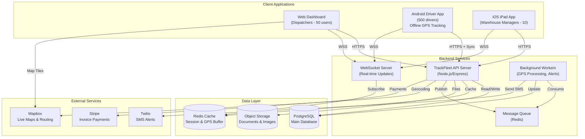
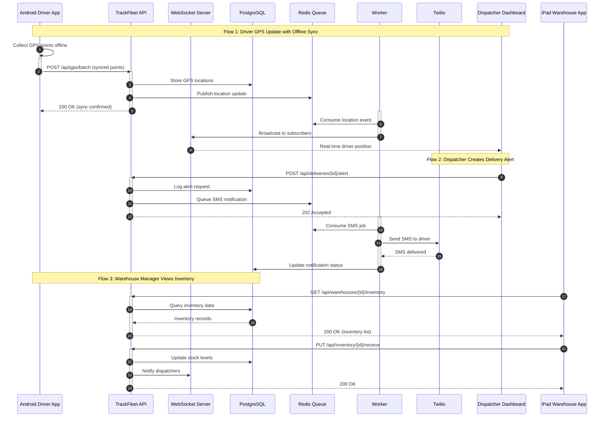
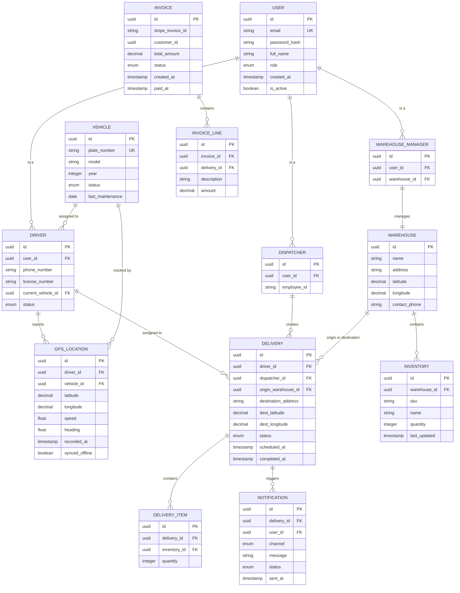
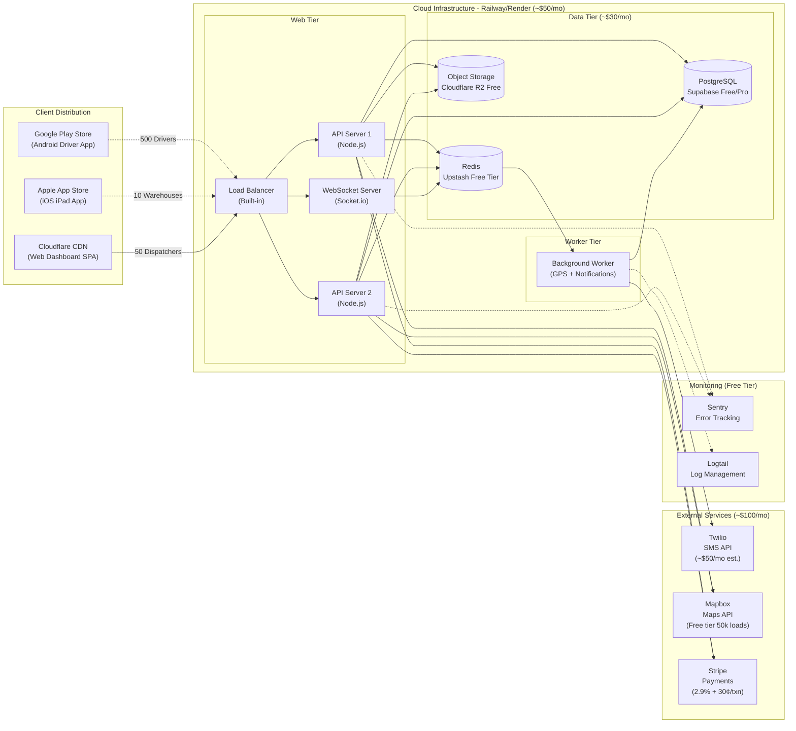

# System Architecture Document

## Project Overview
**Repository:** SmitVgithub/ibm
**Language:** nodejs
**Request:** Build a real-time fleet management system called "TrackFleet" for a logistics company. It needs a web dashboard for dispatchers, an Android-only driver app with offline GPS tracking, and an iOS iPad app for warehouse managers. Integrate with Twilio for SMS alerts, Mapbox for live maps, and Stripe for invoice payments. Expected 500 drivers, 50 dispatchers, 10 warehouses. Budget under $300/month.

## Architecture Diagram

### Request Flow

### Database Schema

### Deployment Architecture

## Architecture Narrative

Build a real-time fleet management system called "TrackFleet" for a logistics company. It needs a web dashboard for dispatchers, an Android-only driver app with offline GPS tracking, and an iOS iPad app for warehouse managers. Integrate with Twilio for SMS alerts, Mapbox for live maps, and Stripe for invoice payments. Expected 500 drivers, 50 dispatchers, 10 warehouses. Budget under $300/month.

---
*Generated by Blueprint Brain 1.7*
