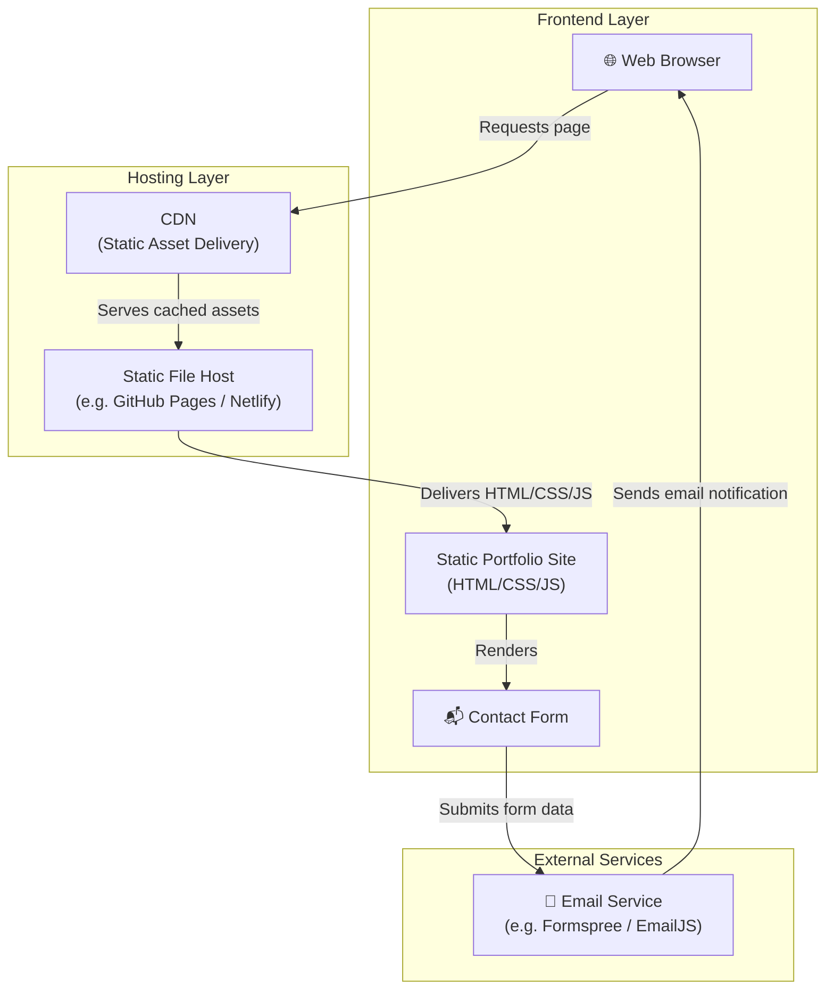
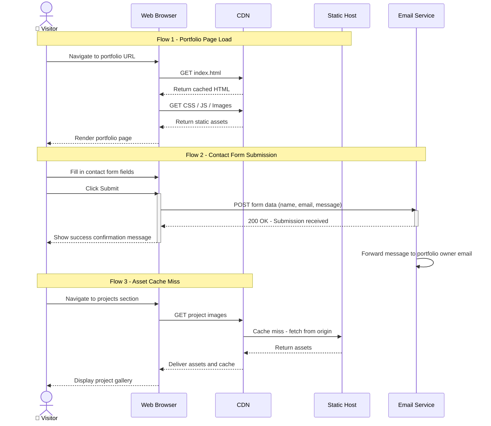
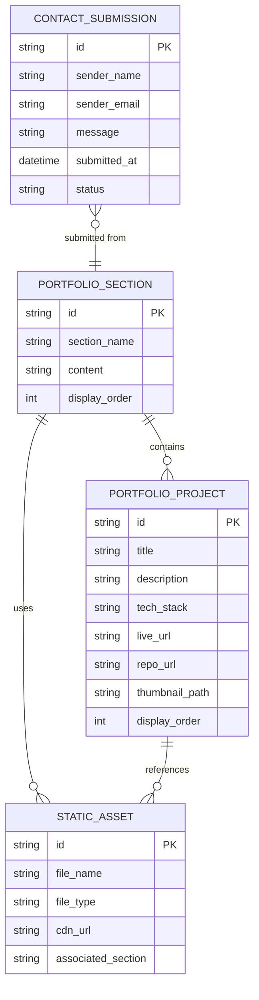
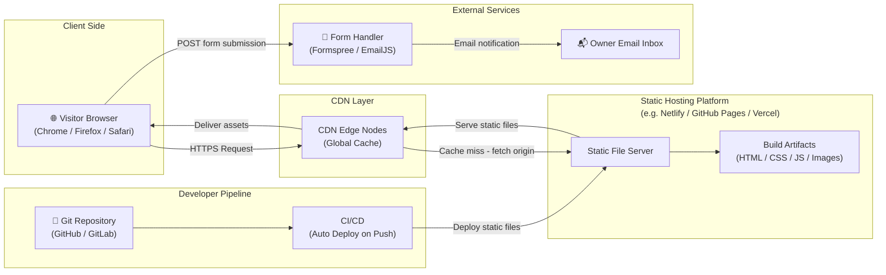

# System Architecture Document

## Project Overview
**Repository:** SmitVgithub/ibm
**Language:** nodejs
**Request:** Answer:
1. `Web` app only
2. static protfolio
3. No CMS
4. Simple contact form

## Architecture Diagram

### Request Flow

### Database Schema

### Deployment Architecture

## Architecture Narrative

Answer:
1. `Web` app only
2. static protfolio
3. No CMS
4. Simple contact form

---
*Generated by Blueprint Brain 1.7*
