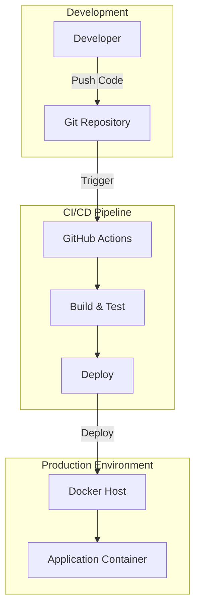

# System Architecture Document

## Project Overview
**Repository:** undefined
**Language:** nodejs
**Request:** I'm working from general hospital website best practices and common patterns for this type of medical/healthcare website. Create the designs of it.

## Executive Summary
This architecture defines a modern, accessible hospital website built with React 18 + Vite, styled with Tailwind CSS, and enhanced with Framer Motion animations. The component-based design enables rapid development and easy maintenance. Key features include a responsive navigation system, hero section with dual CTAs, medical services showcase, doctor profiles, patient testimonials, and a robust appointment booking form. The architecture prioritizes performance (lazy loading, code splitting), accessibility (WCAG 2.1 compliance), and SEO (semantic HTML, meta tags). Deployment is streamlined via Docker containerization and GitHub Actions CI/CD, with Vercel/Netlify as recommended hosting platforms. The design follows healthcare website best practices, emphasizing trust signals, clear information hierarchy, and prominent emergency contact access.

## System Architecture

### Architecture Diagram

graph TB
    subgraph Client["👤 Client Layer"]
        Browser["🌐 Web Browser"]
        Mobile["📱 Mobile Browser"]
    end

    subgraph CDN["☁️ CDN / Edge Network"]
        Vercel["Vercel Edge Network"]
        Cache["Static Asset Cache"]
    end

    subgraph Frontend["⚛️ React Frontend (Vite)"]
        subgraph Pages["📄 Pages"]
            Home["🏠 Home"]
            About["ℹ️ About"]
            Services["🏥 Services"]
            Doctors["👨‍⚕️ Doctors"]
            Contact["📞 Contact"]
            Appointments["📅 Appointments"]
        end
        
        subgraph Components["🧩 Shared Components"]
            Navbar["🧭 Navbar"]
            Hero["🦸 Hero Section"]
            ServiceCards["💳 Service Cards"]
            DoctorProfiles["👤 Doctor Profiles"]
            TestimonialSlider["⭐ Testimonials"]
            AppointmentForm["📝 Appointment Form"]
            Footer["🦶 Footer"]
        end
        
        subgraph Utilities["🔧 Utilities"]
            Router["React Router v6"]
            FormHandler["React Hook Form"]
            Animations["Framer Motion"]
            Icons["Lucide Icons"]
        end
    end

    subgraph Styling["🎨 Design System"]
        Tailwind["Tailwind CSS"]
        Colors["Brand Colors\n#0077B6 Primary\n#00B4D8 Secondary"]
        Typography["Inter Font Family"]
        Responsive["Mobile-First Breakpoints"]
    end

    subgraph Backend["🖥️ Optional Backend (Node.js)"]
        Express["Express.js API"]
        Validation["Input Validation"]
        EmailService["Email Service\n(Nodemailer)"]
    end

    subgraph External["🌍 External Services"]
        GoogleMaps["📍 Google Maps Embed"]
        Analytics["📊 Google Analytics"]
        EmailProvider["📧 SMTP Provider"]
    end

    subgraph Storage["💾 Data Layer (Optional)"]
        MongoDB[("MongoDB\nAppointments")]
        FileStorage["📁 Image Assets\n/public/assets"]
    end

    Browser --> Vercel
    Mobile --> Vercel
    Vercel --> Cache
    Cache --> Frontend
    
    Home --> Hero
    Home --> ServiceCards
    Home --> DoctorProfiles
    Home --> TestimonialSlider
    Home --> AppointmentForm
    
    Services --> ServiceCards
    Doctors --> DoctorProfiles
    Contact --> GoogleMaps
    Appointments --> AppointmentForm
    
    AppointmentForm --> FormHandler
    FormHandler --> Express
    Express --> Validation
    Validation --> MongoDB
    Validation --> EmailService
    EmailService --> EmailProvider
    
    Frontend --> Tailwind
    Tailwind --> Colors
    Tailwind --> Typography
    Tailwind --> Responsive
    
    Frontend --> Analytics
    Frontend --> FileStorage

### Deployment Architecture

### High-Level Design
This architecture is designed for a modern hospital/healthcare website following industry best practices for medical web applications. The design prioritizes **accessibility, performance, security, and trust** — critical factors for healthcare websites where users often seek urgent information.

**Why This Architecture:**

1. **Component-Based Frontend (React + Vite)**: Healthcare websites require frequent content updates (doctor schedules, services, announcements). A component-based architecture allows isolated updates without affecting the entire site. Vite provides lightning-fast HMR (Hot Module Replacement) for development and optimized production builds.

2. **Static-First with Optional Backend**: Most hospital websites are content-heavy but interaction-light. We use a static-first approach where pages are pre-rendered for SEO and performance. The optional Node.js backend handles dynamic features like appointment booking and contact forms.

3. **Tailwind CSS for Medical UI**: Healthcare UIs require clean, professional aesthetics with high contrast for accessibility (WCAG 2.1 compliance). Tailwind's utility-first approach enables rapid prototyping while maintaining consistency across components.

4. **Form Handling with React Hook Form**: Medical forms (appointments, patient inquiries) require robust validation. React Hook Form provides performant, accessible form handling with minimal re-renders — crucial for mobile users on slower connections.

5. **Framer Motion for Subtle Animations**: Trust is paramount in healthcare. We use subtle, professional animations that enhance UX without appearing frivolous. Animations guide attention to CTAs (Book Appointment) without overwhelming users.

**Trade-offs Considered:**
- **Next.js vs Vite+React**: Next.js offers SSR/SSG out-of-box, but adds complexity. For a hospital website with moderate traffic, Vite's simplicity and speed win. If SEO becomes critical, migration to Next.js is straightforward.
- **Headless CMS vs Static Content**: We chose static content initially for simplicity. For hospitals needing frequent updates by non-technical staff, integrating Strapi or Sanity would be recommended.
- **MongoDB vs PostgreSQL**: If backend is implemented, MongoDB offers flexibility for varying appointment schemas across departments. PostgreSQL would be preferred for strict HIPAA compliance scenarios.

**Scalability Considerations:**
- CDN deployment (Vercel/Netlify) handles traffic spikes during health emergencies
- Lazy loading for images reduces initial load time
- Code splitting ensures users only download necessary JavaScript

**Security for Healthcare:**
- HTTPS enforced at CDN level
- Form submissions sanitized server-side
- No PHI (Protected Health Information) stored in frontend
- Contact forms use honeypot fields for spam prevention

### Component Breakdown
## 🧩 Component Architecture Breakdown

### **Layout Components**

**1. Navbar (`components/Navbar.jsx`)**
- Sticky header with hospital branding
- Responsive hamburger menu for mobile
- Quick-access "Book Appointment" CTA button
- Active route highlighting via NavLink
- Accessibility: ARIA labels, keyboard navigation

**2. Footer (`components/Footer.jsx`)**
- 4-column grid: About, Quick Links, Departments, Contact
- Social media links with hover states
- Copyright and legal links
- Emergency contact prominently displayed

### **Home Page Components**

**3. Hero (`components/Hero.jsx`)**
- Full-width gradient background (brand colors)
- Animated text entrance (Framer Motion)
- Dual CTA buttons: Primary (Book Appointment), Secondary (Our Services)
- Doctor/medical imagery on desktop, hidden on mobile for performance
- Trust indicators: "24/7 Emergency", "Expert Doctors"

**4. Services (`components/Services.jsx`)**
- 6-card grid showcasing medical specialties
- Each card: Icon (Lucide), Title, Description
- Hover effect: subtle lift + shadow increase
- Responsive: 2 columns mobile, 3 columns desktop
- Icons chosen for medical recognition (Heart=Cardiology, Brain=Neurology)

**5. Doctors (`components/Doctors.jsx`)**
- Profile cards with circular avatar images
- Name, specialty, years of experience
- Hover state reveals "View Profile" link
- Lazy-loaded images for performance

**6. Appointments (`components/Appointments.jsx`)**
- React Hook Form integration
- Fields: Name, Phone, Email, Department (dropdown), Preferred Date
- Client-side validation with error messages
- Success toast notification on submission
- Honeypot field for spam prevention

**7. Testimonials (`components/Testimonials.jsx`)**
- Patient review cards with star ratings
- Carousel/slider for mobile (optional)
- Quotes with patient names
- Trust-building social proof

### **Page Components**

**8. Home Page (`pages/Home.jsx`)**
- Composition of: Hero → Services → Doctors → Appointments → Testimonials
- Smooth scroll sections
- SEO meta tags via document.title

**9. Contact Page (`pages/Contact.jsx`)**
- Contact information cards (Address, Phone, Email, Hours)
- Embedded Google Maps iframe
- Contact form (alternative to appointment form)
- Emergency banner for urgent cases

### Technology Stack
## 🛠️ Technology Stack

| Layer | Technology | Version | Justification |
|-------|------------|---------|---------------|
| **Build Tool** | Vite | 4.4+ | Fastest dev server, optimized production builds, native ES modules |
| **Framework** | React | 18.2+ | Component reusability, large ecosystem, excellent DevTools |
| **Routing** | React Router | 6.14+ | Declarative routing, nested routes, active link styling |
| **Styling** | Tailwind CSS | 3.3+ | Utility-first, responsive design, small production bundle |
| **Forms** | React Hook Form | 7.45+ | Performant forms, minimal re-renders, built-in validation |
| **Animations** | Framer Motion | 10.12+ | Declarative animations, gesture support, layout animations |
| **Icons** | Lucide React | 0.263+ | Tree-shakeable, consistent medical/UI icons |
| **Fonts** | Inter | Variable | Professional, highly legible, excellent for medical content |
| **Linting** | ESLint + JSHint | Latest | Code quality, consistent style |
| **Deployment** | Vercel/Netlify | - | Zero-config, global CDN, automatic HTTPS |

### Optional Backend Stack
| Layer | Technology | Justification |
|-------|------------|---------------|
| **Runtime** | Node.js 18+ | JavaScript consistency, async I/O |
| **Framework** | Express.js | Minimal, flexible, well-documented |
| **Database** | MongoDB | Flexible schema for appointments |
| **Email** | Nodemailer | Reliable email delivery |
| **Validation** | Joi/Zod | Schema validation for forms |

## Implementation Phases

## 📅 Implementation Phases

### **Phase 1: Project Setup (Day 1)**
- [ ] Initialize Vite + React project
- [ ] Configure Tailwind CSS with custom colors
- [ ] Set up folder structure (`components/`, `pages/`, `assets/`)
- [ ] Install dependencies (react-router-dom, react-hook-form, framer-motion, lucide-react)
- [ ] Configure ESLint and Prettier
- [ ] Create base layout (Navbar + Footer)

### **Phase 2: Core Components (Days 2-3)**
- [ ] Build Navbar with responsive mobile menu
- [ ] Create Hero section with animations
- [ ] Develop Services grid component
- [ ] Build Doctors profile cards
- [ ] Implement Testimonials section
- [ ] Create Footer with all sections

### **Phase 3: Pages & Routing (Day 4)**
- [ ] Set up React Router with all routes
- [ ] Compose Home page from components
- [ ] Build About page (hospital history, mission)
- [ ] Create Services detail page
- [ ] Develop Doctors listing page
- [ ] Build Contact page with map

### **Phase 4: Forms & Interactivity (Day 5)**
- [ ] Implement Appointment booking form
- [ ] Add form validation with error states
- [ ] Create success/error notifications
- [ ] Add scroll-to-top on route change
- [ ] Implement smooth scroll for anchor links

### **Phase 5: Polish & Optimization (Day 6)**
- [ ] Add page transitions (Framer Motion)
- [ ] Optimize images (WebP, lazy loading)
- [ ] Add SEO meta tags
- [ ] Test accessibility (keyboard nav, screen readers)
- [ ] Mobile responsiveness testing
- [ ] Performance audit (Lighthouse)

### **Phase 6: Deployment (Day 7)**
- [ ] Configure Dockerfile for containerization
- [ ] Set up GitHub Actions CI/CD
- [ ] Deploy to Vercel/Netlify
- [ ] Configure custom domain
- [ ] Set up analytics
- [ ] Final QA testing

## Risk Analysis

## ⚠️ Risk Analysis & Mitigation

### **Technical Risks**

| Risk | Impact | Probability | Mitigation |
|------|--------|-------------|------------|
| **Slow page load on mobile** | High | Medium | Lazy load images, code splitting, CDN caching |
| **Form spam submissions** | Medium | High | Honeypot fields, rate limiting, reCAPTCHA (optional) |
| **Browser compatibility** | Medium | Low | Autoprefixer, test on Safari/Firefox/Chrome |
| **SEO ranking issues** | High | Medium | Proper meta tags, semantic HTML, sitemap.xml |

### **UX Risks**

| Risk | Impact | Probability | Mitigation |
|------|--------|-------------|------------|
| **Users can't find appointment booking** | High | Medium | Sticky CTA in navbar, multiple entry points |
| **Accessibility failures** | High | Medium | WCAG 2.1 audit, proper ARIA labels, color contrast |
| **Mobile navigation confusion** | Medium | Medium | Clear hamburger icon, full-screen mobile menu |

### **Business Risks**

| Risk | Impact | Probability | Mitigation |
|------|--------|-------------|------------|
| **Outdated doctor/service info** | High | High | Consider headless CMS for easy updates |
| **No appointment confirmation** | High | Medium | Email notifications via backend service |
| **Competitor comparison** | Medium | Medium | Focus on trust signals, testimonials, certifications |

### **Security Risks**

| Risk | Impact | Probability | Mitigation |
|------|--------|-------------|------------|
| **XSS via form inputs** | High | Low | Sanitize all inputs, CSP headers |
| **Data exposure** | Critical | Low | No PHI in frontend, HTTPS only |
| **DDoS on form endpoints** | Medium | Low | Rate limiting, Cloudflare protection |

## Dependencies
- **VITE_GOOGLE_MAPS_API_KEY**: Google Maps API key for embedded location map (optional, can use embed URL)
- **VITE_GA_TRACKING_ID**: Google Analytics tracking ID for visitor analytics
- **SMTP_HOST**: SMTP server for appointment confirmation emails (backend only)
- **SMTP_USER**: SMTP username for email service (backend only)
- **SMTP_PASS**: SMTP password for email service (backend only)

## Interactive Visualization
For an interactive view of this architecture, open **ARCHITECTURE_PREVIEW.html** in your browser.

## Next Steps
1. Review this architecture document
2. Open ARCHITECTURE_PREVIEW.html for interactive diagrams
3. Validate technical decisions
4. Use AutoX brain to implement the architecture
5. Deploy to staging environment
6. Run integration tests
7. Deploy to production

---
*Generated by Blueprint Brain - The Architect*
*Date: 2026-08-05T14:23:33.781Z*
