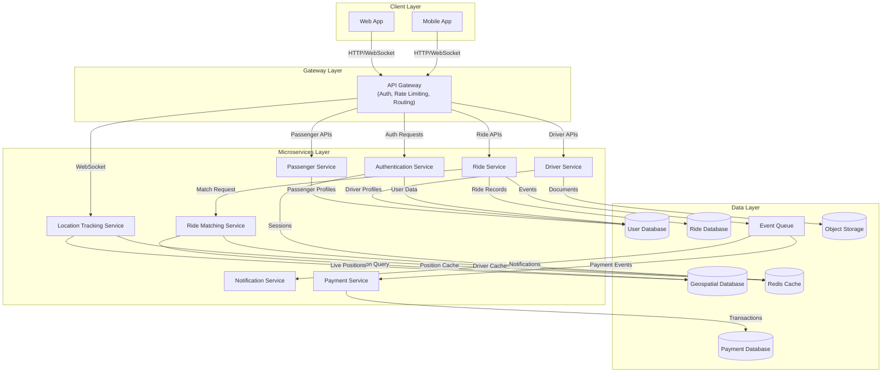
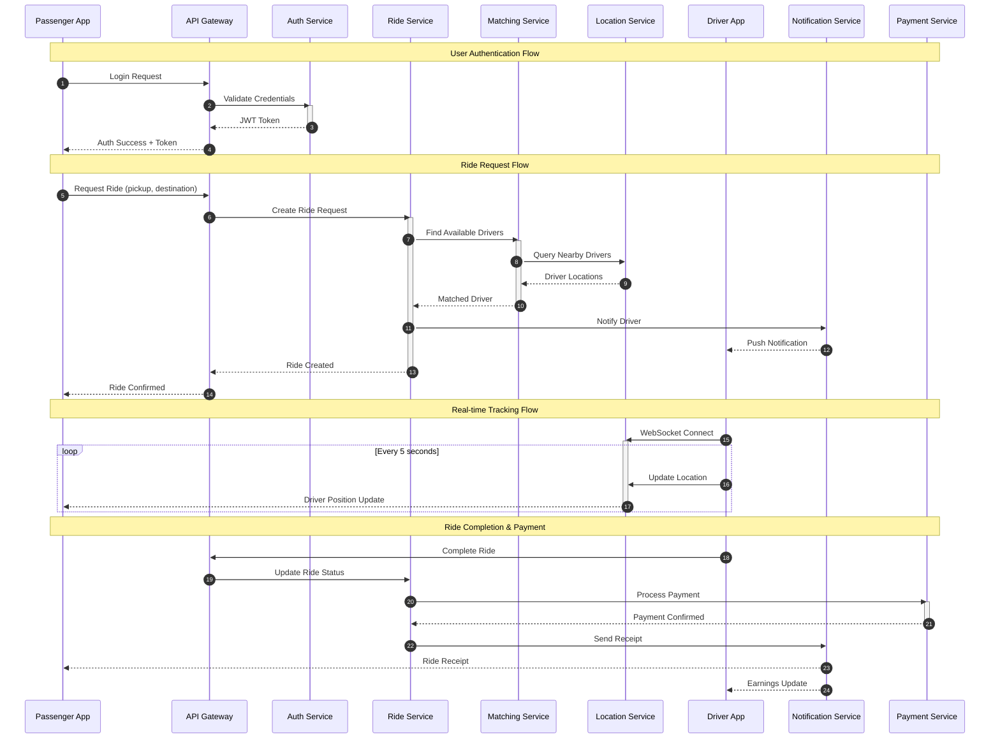
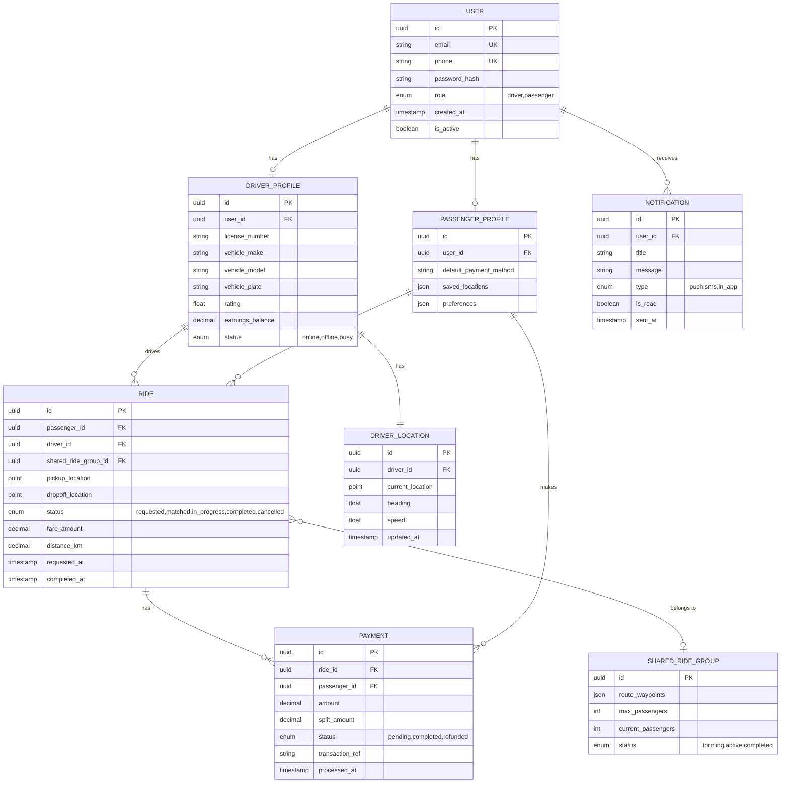
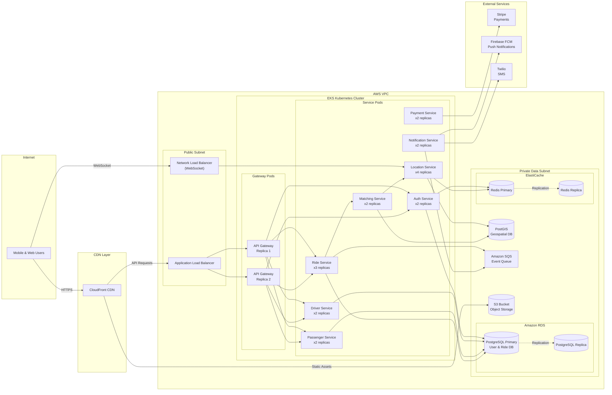

# System Architecture Document

## Project Overview
**Repository:** SmitVgithub/ibm
**Language:** nodejs
**Request:** Create a taxi driver application with a real-time ride sharing.

## Architecture Diagram

### Request Flow

### Database Schema

### Deployment Architecture

## Architecture Narrative

Build a real-time taxi driver application with ride-sharing capabilities. The system enables drivers to receive and manage ride requests, passengers to book rides and share them with others heading in similar directions, and provides real-time location tracking, fare splitting, and route optimization. The architecture leverages WebSocket connections for real-time updates, a geospatial database for location-based matching, and a message queue for reliable event processing. Given the existing repository has Node.js tooling and Docker support, we'll build on that foundation with a microservices approach suitable for scaling ride-sharing operations.

## Components

- **API Gateway** (gateway): Central entry point handling authentication, rate limiting, and request routing to microservices. Manages WebSocket upgrade requests for real-time features.
- **Authentication Service** (service): Handles user registration, login, token management, and role-based access control for drivers and passengers.
- **Driver Service** (service): Manages driver profiles, availability status, vehicle information, ratings, and earnings tracking.
- **Passenger Service** (service): Manages passenger profiles, ride history, saved locations, payment methods, and preferences.
- **Ride Service** (service): Core ride management handling ride creation, status updates, fare calculation, and ride-sharing coordination including fare splitting.
- **Ride Matching Service** (service): Intelligent matching engine that pairs passengers with drivers and identifies ride-sharing opportunities based on route similarity, timing, and preferences.
- **Location Tracking Service** (service): Real-time location tracking service handling WebSocket connections for live driver positions, ETA updates, and trip progress.
- **Notification Service** (service): Handles push notifications, SMS alerts, and in-app notifications for ride updates, promotions, and system messages.
- **Payment Service** (service): Processes payments, handles fare splitting for shared rides, manages refunds, and driver payouts.
- **User Database** (database): Primary database for user accounts, driver profiles, passenger profiles, and authentication data.
- **Ride Database** (database): Stores ride records, trip history, fare calculations, and ride-sharing group information.
- **Geospatial Database** (database): Specialized geospatial database for real-time driver locations, geofencing, and spatial queries for ride matching.
- **Payment Database** (database): Secure storage for payment transactions, wallet balances, and financial records with audit logging.
- **Redis Cache** (cache): In-memory cache for session management, real-time driver locations, rate limiting, and Socket.io adapter for horizontal scaling.
- **Event Queue** (queue): Message broker for async event processing including ride events, notifications, and payment processing.
- **Object Storage** (storage): Stores driver documents, profile images, and ride receipts.

---
*Generated by Blueprint Brain 1.7*
