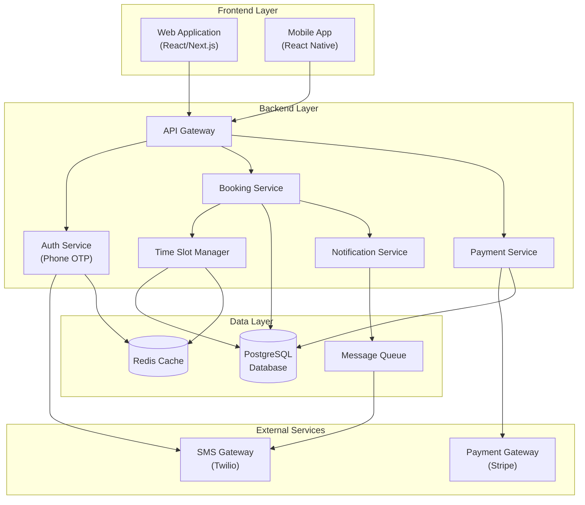
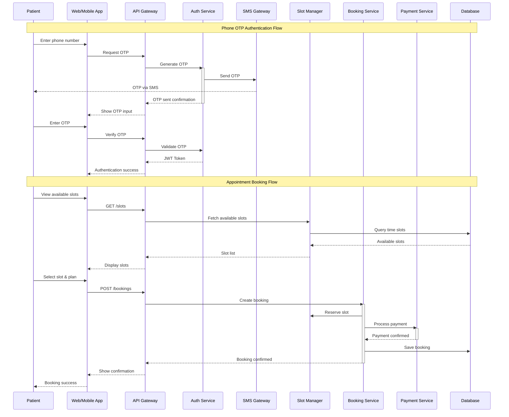
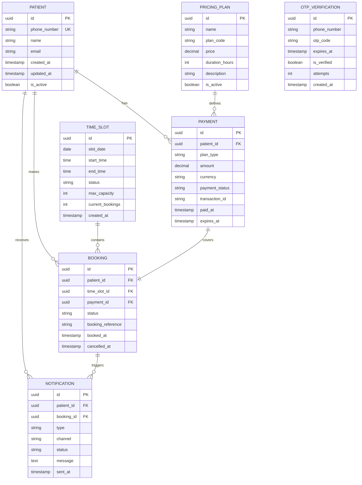
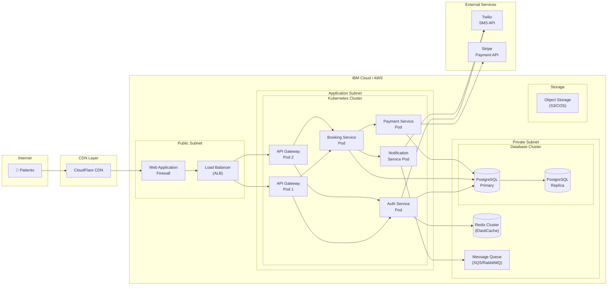

# System Architecture Document

## Project Overview
**Repository:** SmitVgithub/ibm
**Language:** nodejs
**Request:** Answer:
1. No preference - recommend the best option
2. Fixed time slots predefined in the system
3. Pay per session (basic - $19 for 1 hours session, Pro $35 - 1 week and custom - contact support)
4. Phone OTP only

Only one user type - patients (book appointments).

## Architecture Diagram

### Request Flow

### Database Schema

### Deployment Architecture

## Architecture Narrative

Answer:
1. No preference - recommend the best option
2. Fixed time slots predefined in the system
3. Pay per session (basic - $19 for 1 hours session, Pro $35 - 1 week and custom - contact support)
4. Phone OTP only

Only one user type - patients (book appointments).

---
*Generated by Blueprint Brain 1.7*
