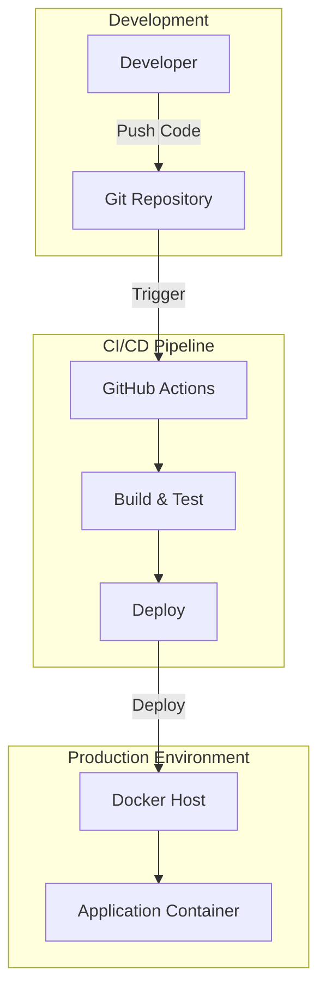

# Architecture Document — ibm

> Generated by Blueprint Brain

**Repository:** ibm  
**Language:** nodejs  
**Request:** Create a taxi driver application with a real-time ride sharing.

---

## Architectural Analysis

This taxi driver application with real-time ride sharing requires a robust, scalable architecture designed to handle concurrent users, real-time location tracking, and instant communication between drivers and passengers. I've designed a microservices-based architecture using Node.js for the backend services, which aligns with the repository's existing technology stack.

**Core Design Decisions:**

1. **Microservices Architecture**: I've separated concerns into distinct services (User Service, Ride Service, Location Service, Notification Service, Payment Service) to enable independent scaling and deployment. The ride-sharing feature demands high availability for location tracking while payment processing can tolerate slightly higher latency.

2. **Real-Time Communication**: Socket.IO is chosen for WebSocket connections to enable real-time location updates, ride status changes, and instant notifications. This bidirectional communication is essential for showing driver positions on passenger maps and vice versa.

3. **Event-Driven Architecture**: Redis Pub/Sub handles inter-service communication for events like ride requests, driver acceptance, and status updates. This decouples services and allows for horizontal scaling of event consumers.

4. **Geospatial Capabilities**: MongoDB with geospatial indexes efficiently handles location-based queries like 'find nearest available drivers within 5km radius'. PostGIS on PostgreSQL handles complex ride-sharing route matching algorithms.

5. **API Gateway Pattern**: Kong/Express Gateway provides a single entry point, handling authentication, rate limiting, and request routing. This simplifies client implementation and centralizes cross-cutting concerns.

**Trade-offs Considered:**
- **Monolith vs Microservices**: While a monolith would be simpler initially, the real-time nature and expected scale of a taxi app justifies microservices complexity.
- **Socket.IO vs raw WebSockets**: Socket.IO adds overhead but provides automatic reconnection, room management, and fallback mechanisms crucial for mobile networks.
- **Redis vs RabbitMQ**: Redis Pub/Sub is simpler and sufficient for our use case; RabbitMQ would be overkill unless we need guaranteed message delivery for critical operations.

**Scalability Considerations:**
- Location Service will receive the highest load (updates every 3-5 seconds per active driver)
- Horizontal scaling via Kubernetes with HPA based on CPU/memory metrics
- Redis Cluster for session storage and pub/sub at scale
- Database read replicas for query-heavy operations

## Summary

This architecture delivers a production-ready taxi application with real-time ride sharing using a microservices approach built on Node.js. The system separates concerns into six core services (User, Ride, Location, Sharing, Notification, Payment) communicating via Redis Pub/Sub and REST APIs. Real-time features are powered by Socket.IO with Redis adapter for horizontal scaling. The dual-database strategy uses PostgreSQL for transactional data and MongoDB for high-frequency location updates. The architecture supports the critical ride-sharing feature through a dedicated Sharing Service that matches compatible routes using geospatial algorithms. Kubernetes orchestration ensures auto-scaling during peak demand, while comprehensive monitoring via Prometheus/Grafana provides operational visibility.

## System Architecture

graph TB
    subgraph Client["Client Layer"]
        MA["📱 Mobile App\n(React Native)"]
        WA["🌐 Web Dashboard\n(React.js)"]
        DA["📱 Driver App\n(React Native)"]
    end

    subgraph Gateway["API Gateway Layer"]
        AG["🚪 API Gateway\n(Kong/Express)"]
        LB["⚖️ Load Balancer\n(Nginx)"]
    end

    subgraph Services["Microservices Layer"]
        US["👤 User Service\n(Auth/Profile)"]
        RS["🚗 Ride Service\n(Booking/Matching)"]
        LS["📍 Location Service\n(GPS Tracking)"]
        NS["🔔 Notification Service\n(Push/SMS)"]
        PS["💳 Payment Service\n(Transactions)"]
        SS["🤝 Sharing Service\n(Route Matching)"]
    end

    subgraph RealTime["Real-Time Layer"]
        SIO["⚡ Socket.IO Server\n(WebSocket)"]
        RPS["📡 Redis Pub/Sub\n(Events)"]
    end

    subgraph Data["Data Layer"]
        PG[("🐘 PostgreSQL\n(Users/Rides)")]
        MG[("🍃 MongoDB\n(Locations/Logs)")]
        RD[("⚡ Redis\n(Cache/Sessions)")]
    end

    subgraph External["External Services"]
        GM["🗺️ Google Maps API"]
        TW["📱 Twilio SMS"]
        FC["🔥 Firebase Cloud\nMessaging"]
        ST["💰 Stripe\nPayments"]
    end

    subgraph Infrastructure["Infrastructure"]
        K8["☸️ Kubernetes\nCluster"]
        PR["📊 Prometheus\nMetrics"]
        GF["📈 Grafana\nDashboard"]
        ELK["📝 ELK Stack\nLogging"]
    end

    MA --> LB
    WA --> LB
    DA --> LB
    LB --> AG
    
    AG --> US
    AG --> RS
    AG --> LS
    AG --> PS
    AG --> SS
    
    MA <--> SIO
    DA <--> SIO
    
    SIO <--> RPS
    LS <--> RPS
    RS <--> RPS
    NS <--> RPS
    SS <--> RPS
    
    US --> PG
    RS --> PG
    PS --> PG
    SS --> PG
    
    LS --> MG
    RS --> MG
    
    US --> RD
    RS --> RD
    LS --> RD
    SIO --> RD
    
    LS --> GM
    SS --> GM
    NS --> TW
    NS --> FC
    PS --> ST
    
    Services --> K8
    K8 --> PR
    PR --> GF
    Services --> ELK

## Deployment Architecture

## Component Breakdown

**1. User Service (Port 3001)**
Handles authentication (JWT tokens), user registration, profile management, and driver verification. Stores user data in PostgreSQL with bcrypt password hashing. Manages driver documents, vehicle information, and rating systems.

**2. Ride Service (Port 3002)**
Core business logic for ride booking, driver matching algorithm, fare calculation, and ride lifecycle management. Implements the ride-sharing matching algorithm that groups passengers with similar routes. Uses PostgreSQL for ride records and MongoDB for ride history analytics.

**3. Location Service (Port 3003)**
High-frequency service receiving GPS updates every 3-5 seconds from active drivers. Uses MongoDB with 2dsphere indexes for geospatial queries. Publishes location updates to Redis Pub/Sub for real-time map updates. Implements geofencing for airport/station zones.

**4. Sharing Service (Port 3004)**
Specialized service for ride-sharing route matching. Uses PostGIS for complex spatial queries to find compatible rides based on pickup/dropoff proximity, route overlap percentage, and time windows. Calculates fare splitting based on distance contribution.

**5. Notification Service (Port 3005)**
Manages all outbound communications: push notifications via Firebase Cloud Messaging, SMS via Twilio for ride confirmations, and in-app notifications via Socket.IO. Implements notification preferences and quiet hours.

**6. Payment Service (Port 3006)**
Integrates with Stripe for payment processing. Handles fare calculation, promo codes, driver payouts, and refunds. Implements escrow pattern for ride payments released upon completion. PCI-compliant with tokenized card storage.

**7. Socket.IO Server (Port 3007)**
Dedicated WebSocket server for real-time features. Manages rooms for each active ride, broadcasts driver locations, and handles instant messaging between driver and passenger. Uses Redis adapter for horizontal scaling across multiple Socket.IO instances.

**8. API Gateway**
Kong or Express Gateway handling request routing, JWT validation, rate limiting (100 req/min for standard users), request/response transformation, and API versioning. Implements circuit breaker pattern for downstream service failures.

## Technology Stack

**Backend Framework:** Node.js 20 LTS with Express.js
- Justification: Aligns with existing repository stack, excellent for I/O-heavy real-time applications, vast ecosystem

**Real-Time:** Socket.IO 4.x
- Justification: Built-in reconnection, room management, Redis adapter for scaling, fallback to long-polling

**Primary Database:** PostgreSQL 15
- Justification: ACID compliance for financial transactions, PostGIS extension for geospatial queries, mature and reliable

**Document Store:** MongoDB 7.0
- Justification: Flexible schema for location logs, native geospatial indexes, high write throughput for GPS data

**Cache/Message Broker:** Redis 7.x
- Justification: Sub-millisecond latency, Pub/Sub for events, session storage, geospatial commands (GEORADIUS)

**Mobile Apps:** React Native
- Justification: Single codebase for iOS/Android, excellent maps integration, large community

**Web Dashboard:** React.js with TypeScript
- Justification: Type safety, component reusability, excellent tooling

**Maps Integration:** Google Maps Platform
- Justification: Best-in-class routing, traffic data, Places API for address autocomplete

**Container Orchestration:** Kubernetes
- Justification: Auto-scaling, self-healing, rolling deployments, service discovery

**CI/CD:** GitHub Actions
- Justification: Native GitHub integration, matrix builds, extensive marketplace actions

**Monitoring:** Prometheus + Grafana
- Justification: Industry standard, excellent Kubernetes integration, custom dashboards

**Logging:** ELK Stack (Elasticsearch, Logstash, Kibana)
- Justification: Centralized logging, powerful search, visualization capabilities

## Implementation Phases

**Phase 1: Foundation (Weeks 1-3)**
- Set up monorepo structure with shared packages
- Configure Docker development environment
- Implement User Service with JWT authentication
- Set up PostgreSQL and MongoDB databases
- Create basic CI/CD pipeline with GitHub Actions
- Deliverable: User registration/login working

**Phase 2: Core Ride System (Weeks 4-6)**
- Implement Ride Service with booking flow
- Build Location Service with GPS tracking
- Integrate Google Maps for routing
- Set up Socket.IO for real-time updates
- Implement basic driver matching algorithm
- Deliverable: Single-passenger ride booking functional

**Phase 3: Real-Time Features (Weeks 7-9)**
- Build real-time location broadcasting
- Implement ride status updates via WebSocket
- Add in-app messaging between driver/passenger
- Create ETA calculations with traffic data
- Deliverable: Full real-time ride tracking

**Phase 4: Ride Sharing (Weeks 10-12)**
- Implement Sharing Service with route matching
- Build fare splitting algorithm
- Add shared ride UI/UX in mobile apps
- Implement pickup/dropoff sequencing
- Deliverable: Ride sharing feature complete

**Phase 5: Payments & Notifications (Weeks 13-15)**
- Integrate Stripe payment processing
- Implement Notification Service
- Add push notifications and SMS
- Build driver payout system
- Deliverable: End-to-end payment flow

**Phase 6: Production Readiness (Weeks 16-18)**
- Set up Kubernetes cluster
- Implement monitoring and alerting
- Load testing and performance optimization
- Security audit and penetration testing
- Deliverable: Production deployment ready

## Risk Analysis

**High Risk: Real-Time Scalability**
- Risk: Socket.IO server overwhelmed during peak hours
- Impact: Delayed location updates, poor user experience
- Mitigation: Redis adapter for horizontal scaling, implement connection pooling, use sticky sessions with load balancer

**High Risk: Location Service Bottleneck**
- Risk: High-frequency GPS updates causing database write bottleneck
- Impact: Stale driver locations, incorrect matching
- Mitigation: Batch writes to MongoDB, use Redis for hot data, implement write-behind caching

**Medium Risk: Payment Processing Failures**
- Risk: Stripe API downtime or network issues
- Impact: Failed ride completions, revenue loss
- Mitigation: Implement retry with exponential backoff, queue failed payments, manual reconciliation process

**Medium Risk: Third-Party API Dependencies**
- Risk: Google Maps API rate limits or outages
- Impact: No routing, ETA calculations fail
- Mitigation: Implement caching for common routes, fallback to OpenStreetMap, request quota monitoring

**Medium Risk: Data Consistency in Microservices**
- Risk: Distributed transactions failing partially
- Impact: Inconsistent ride/payment states
- Mitigation: Saga pattern for distributed transactions, event sourcing for audit trail, compensation transactions

**Low Risk: Mobile App Network Issues**
- Risk: Poor connectivity in certain areas
- Impact: Missed ride requests, location gaps
- Mitigation: Offline queue for requests, location interpolation, aggressive retry logic

**Security Risk: Location Data Privacy**
- Risk: Unauthorized access to user location history
- Impact: Privacy violations, regulatory fines
- Mitigation: Encrypt location data at rest, implement data retention policies, GDPR compliance, audit logging

## Required Secrets & Environment Variables

- `JWT_SECRET` — Secret key for signing JWT tokens (min 256 bits)
- `DATABASE_URL` — PostgreSQL connection string
- `MONGODB_URI` — MongoDB connection string
- `REDIS_URL` — Redis connection string
- `GOOGLE_MAPS_API_KEY` — Google Maps Platform API key for routing and geocoding
- `STRIPE_SECRET_KEY` — Stripe secret key for payment processing
- `STRIPE_WEBHOOK_SECRET` — Stripe webhook signing secret
- `TWILIO_ACCOUNT_SID` — Twilio account SID for SMS
- `TWILIO_AUTH_TOKEN` — Twilio authentication token
- `TWILIO_PHONE_NUMBER` — Twilio phone number for sending SMS
- `FIREBASE_SERVICE_ACCOUNT` — Firebase service account JSON for push notifications
- `DOCKERHUB_USERNAME` — Docker Hub username for image publishing
- `DOCKERHUB_TOKEN` — Docker Hub access token

## Next Steps

1. Set up the development environment by running docker-compose up to start all services locally
2. Configure all required secrets in GitHub repository settings for CI/CD pipeline
3. Create Google Cloud Platform project and enable Maps JavaScript API, Directions API, and Places API
4. Set up Stripe account and configure webhook endpoints for payment events
5. Create Firebase project and download service account credentials for push notifications
6. Set up Twilio account and verify phone numbers for SMS notifications
7. Review and customize the driver matching algorithm in matching.service.js based on business requirements
8. Configure Kubernetes cluster (GKE, EKS, or AKS) and apply infrastructure manifests
9. Set up monitoring stack (Prometheus + Grafana) and configure alerting rules
10. Conduct load testing with k6 or Artillery to validate scalability assumptions
11. Perform security audit focusing on authentication, data encryption, and API security
12. Create mobile app projects using React Native and integrate with backend APIs

---
*Generated by Blueprint Brain — Thinks before building.*
