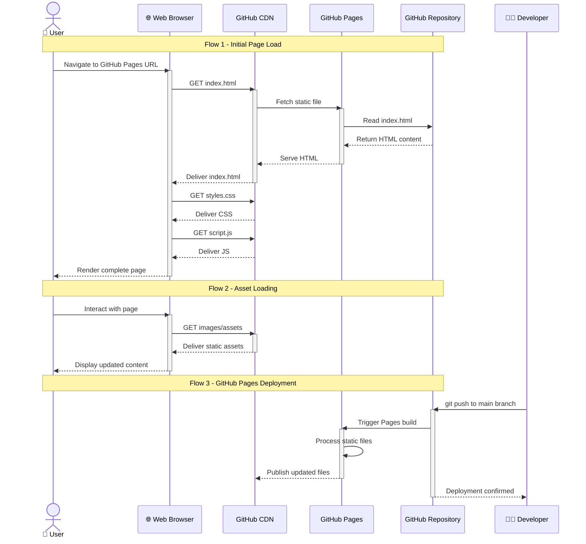
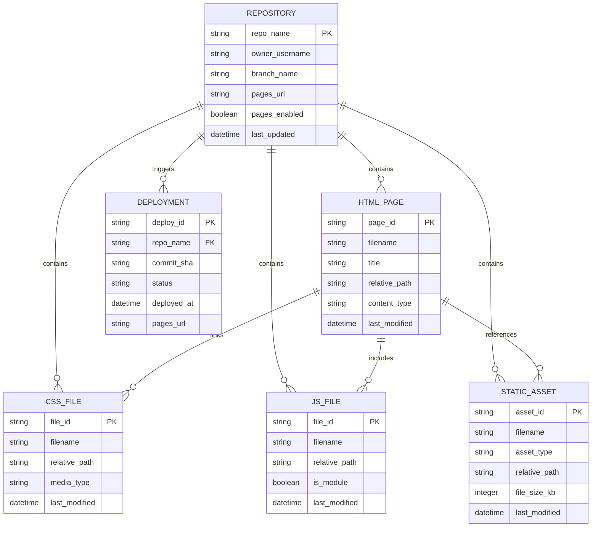
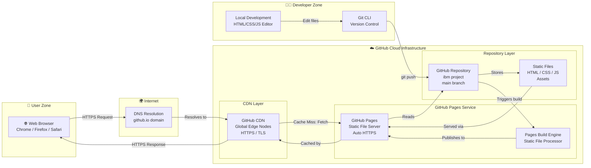

# System Architecture Document

## Project Overview
**Repository:** SmitVgithub/ibm
**Language:** nodejs
**Request:** Answer:
1. GitHub pages
2. Basic Information
3. Pure static
4. Plan HTML/CSS/JS

Only web based

## Architecture Diagram

```mermaid
flowchart TD
  subgraph Frontend ["Frontend Layer (Static Web)"] 
    Browser["🌐 Web Browser\nUser Client"]
    HTML["HTML Pages\nStructure & Content"]
    CSS["CSS Stylesheets\nStyling & Layout"]
    JS["JavaScript\nInteractivity & Logic"]
  end

  subgraph Hosting ["Hosting Layer"]
    GHP["GitHub Pages\nStatic File Hosting"]
    Repo["GitHub Repository\nSource Code & Assets"]
  end

  subgraph Delivery ["Content Delivery"]
    CDN["GitHub CDN\nGlobal Content Delivery"]
    Assets["Static Assets\nImages, Fonts, Files"]
  end

  Browser -->|"HTTP Request"| CDN
  CDN -->|"Serve Static Files"| GHP
  GHP -->|"Reads from"| Repo
  Repo -->|"Contains"| HTML
  Repo -->|"Contains"| CSS
  Repo -->|"Contains"| JS
  Repo -->|"Contains"| Assets
  HTML -->|"Rendered in"| Browser
  CSS -->|"Styled in"| Browser
  JS -->|"Executed in"| Browser
  Assets -->|"Loaded by"| Browser
```

### Request Flow



### Database Schema



### Deployment Architecture



## Architecture Narrative

Answer:
1. GitHub pages
2. Basic Information
3. Pure static
4. Plan HTML/CSS/JS

Only web based


---
*Generated by Blueprint Brain 1.7*
